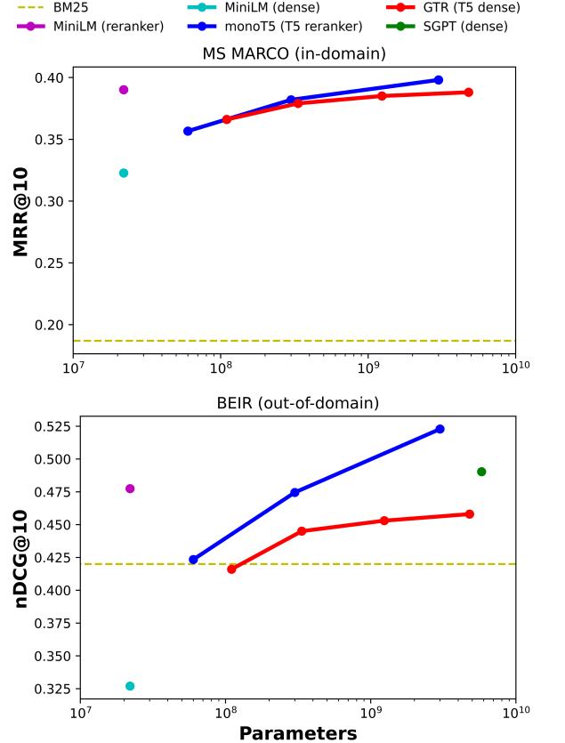

# No Parameter Left Behind: How Distillation and Model Size Affect Zero-Shot Retrieval

This repository contains the code to reproduce the results presented in the paper [No Parameter Left Behind: How Distillation and Model Size Affect Zero-Shot Retrieval](https://arxiv.org/abs/2206.02873).

In this work, we show that increasing model size results in marginal gains on in-domain test sets, but much larger gains in new domains never seen during fine-tuning. Furthermore, we show that rerankers largely outperform dense ones of similar size in several tasks. Our largest reranker reaches the state of the art in 12 of the 18 datasets of the Benchmark-IR (BEIR).

~~~ {.xml
 @article{Rosa_2022,
    title={No Parameter Left Behind: How Distillation and Model Size Affect Zero-Shot Retrieval},
    author={Rosa, Guilherme and Bonifacio, Luiz and Jeronymo, Vitor and Abonizio, Hugo and Fadaee, Marzieh and Lotufo, Roberto and Nogueira, Rodrigo},
    journal={https://arxiv.org/abs/2206.02873},
    year={2022}
}
